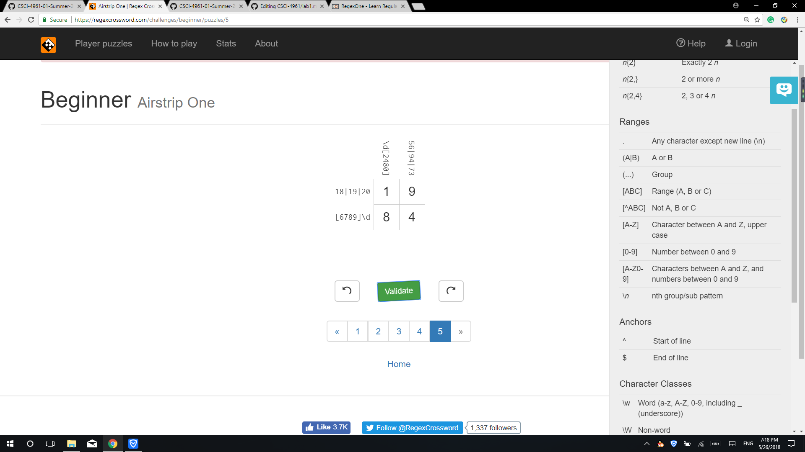

## c. Reading assignments
#### suggestions for How To Answer Questions in a Helpful Way
1. Show the efforts that I already done how to solve the problem, but still unable to solve the problem. Like showing the materials I read.
2. Show why I can’t solve the issue, like why I think this issue hard, and what I’ve already try, and what the next step I plan to do, and especially what made me stuck.

#### Free Culture chapter3
  I think Jesse just provided a platform for students to share. Even though there might be some one violate the copy right law, it is not him that induce them to do so. RIAA wanted to use their power to prevent sharing in the society, but we also can't tell they did somthing intentionally evil(but the way they chosen dealing with this thing is really immoral). Because they just fight for their profit, and it is indeed pretty annoying there is some one violate the copyright. But I think we can just leave the copyright stuff to law and government, and the law needs to adjust a little bit, like punish thoese companies like RIAA.

## d. Linux

## e. Regex

