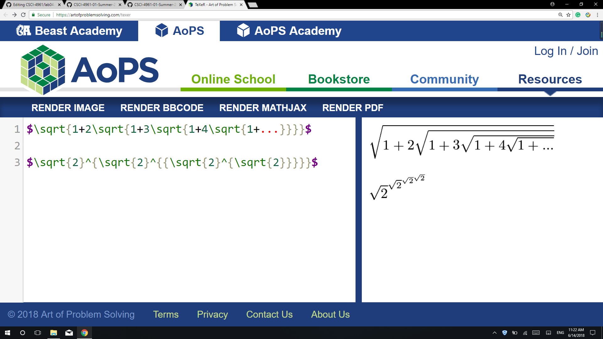
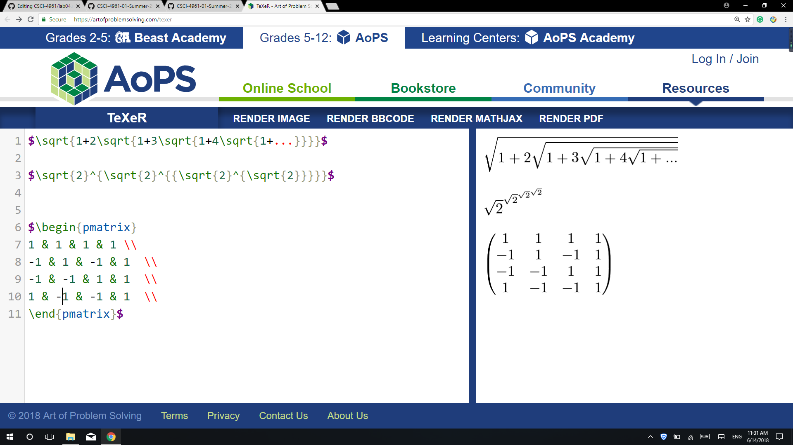

### Part0 - Documentation
#### 1. On your github wiki page (using Markdown or reStructuredText) write a brief description of your project
https://github.com/WEICANSHI/CSCI-4961/wiki/Project

#### 2. Use latex http://www.artofproblemsolving.com/texer to generate the formulae depicted in https://github.com/rcos/CSCI-4961-01-Summer-2018/blob/master/Labs/latex_formulae.png

#### 3. Use latex to display a Hadamard Matrix of size 4

### Part1 - Community
#### 3.Look up by hand and record 
YACS: 2785 lines, 10 contributors, latest commit Mar 5, 2017, first commit  Sep 16 2015, branches: 13  
Astro.IQ : 124119 lines, 1 contributor, latest commit May 3, 2017, first commit Jan 28, 2017, branches: 1 
clickitnticket : 1347 lines ,4 contributors, latest commit Mar 21, 2017, first commit Sep 13, 2016, branches: 8 
FullScreenPokemon : 340905 lines, 14 contributors, latest commit May 31, 2018, first commit Nov 29 2014 , branches: 92 
